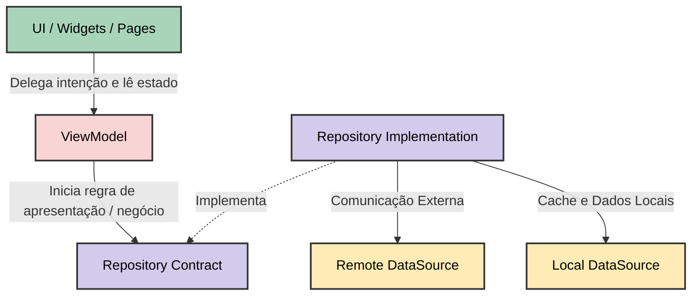

# Arquitetura do Projeto (Feature-First)

Este documento descreve a arquitetura refatorada do projeto, orientada a funcionalidades (Feature-First). O objetivo dessa mudança foi escalar e organizar as responsabilidades das classes existentes que, embora corretas, encontravam-se fragmentadas em pastas puramente técnicas.

## Diagrama do Fluxo

A comunicação flui de forma unidirecional (UI → VM → Repo → DataSources), respeitando as fronteiras arquiteturais:



### Estrutura de Diretórios Resultante

Abaixo a representação da árvore de pastas e arquivos após a refatoração:

```text
lib/
  core/
    app_root.dart
    app_errors.dart
  features/
    todos/
      data/
        datasources/
          todo_remote_datasource.dart
          todo_local_datasource.dart
        models/
          todo_model.dart
        repositories/
          todo_repository_impl.dart
      domain/
        entities/
          todo.dart
        repositories/
          todo_repository.dart
      presentation/
        pages/
          todos_page.dart
        viewmodels/
          todo_viewmodel.dart
        widgets/
          add_todo_dialog.dart
  main.dart
```

## Justificativa da Estrutura

A estrutura original misturava todos os arquivos referentes a várias partes do sistema em pastas genéricas como `screens`, `models` e `viewmodels`.

Para uma aplicação robusta, consolidamos a arquitetura **Feature-First**, conforme exemplificado pela feature `todos`:

1.  **`lib/core/`**: Elementos transversais que configuram a aplicação ou são amplamente reutilizados. Por exemplo, mensagens de erro (`app_errors.dart`) e a raiz que invoca o `MaterialApp` (`app_root.dart`).
2.  **`lib/features/todos/domain/`**: Coração da funcionalidade. Nele reside a entidade `todo.dart` e o contrato abstrato `todo_repository.dart`. Esta camada é independente e ignorante de qualquer framework, como Flutter, HTTP ou SharedPreferences.
3.  **`lib/features/todos/data/`**: Responsável pela orquestração dos dados.
    *   **DataSources**: `todo_remote_datasource.dart` (para HTTP) e `todo_local_datasource.dart` (SharedPreferences).
    *   **Models (DTOs)**: O `todo_model.dart` estende a entidade e sabe fazer o parser de JSON (conversão `fromJson` / `toJson`).
    *   **Repositories (`todo_repository_impl.dart`)**: Implementa o contrato de Domain e contém a inteligência de escolha e mapeamento entre fontes locais e remotas.
4.  **`lib/features/todos/presentation/`**: Acopla o visual e a gerência do seu estado. Contém os **Widgets**, **Pages** e o **ViewModel**.

## Decisões de Responsabilidade

*   **A UI não pode chamar HTTP nem SharedPreferences diretamente**: Essa responsabilidade foi abstraída para os `DataSources`, removendo a lógica da camada de apresentação para evitar acoplamento do framework visual aos detalhes de infraestrutura ou SDKs.
*   **O ViewModel não pode conhecer Widgets / BuildContext (exceto mensagens via estado)**: O `TodoViewModel` possui variáveis (`isLoading`, `errorMessage`, `items`) e expõe métodos. Ele nunca importa `material.dart` ou lida com navegação direta utilizando contexto. Todas as reações UI-driven acontecem passivamente ouvindo as atualizações disparadas por `notifyListeners()`.
*   **O Repository deve centralizar a escolha entre remoto/local**: O fluxo de dados deve passar por classes como `TodoRepositoryImpl`. Ela coordena as requisições (`_remote.fetchTodos`) e faz interações locais necessárias (ex: atualizando o tempo do último sincronismo com `_local.saveLastSync(now)`). Para o `ViewModel`, a origem real dos dados é um detalhe invisível e transparente.
